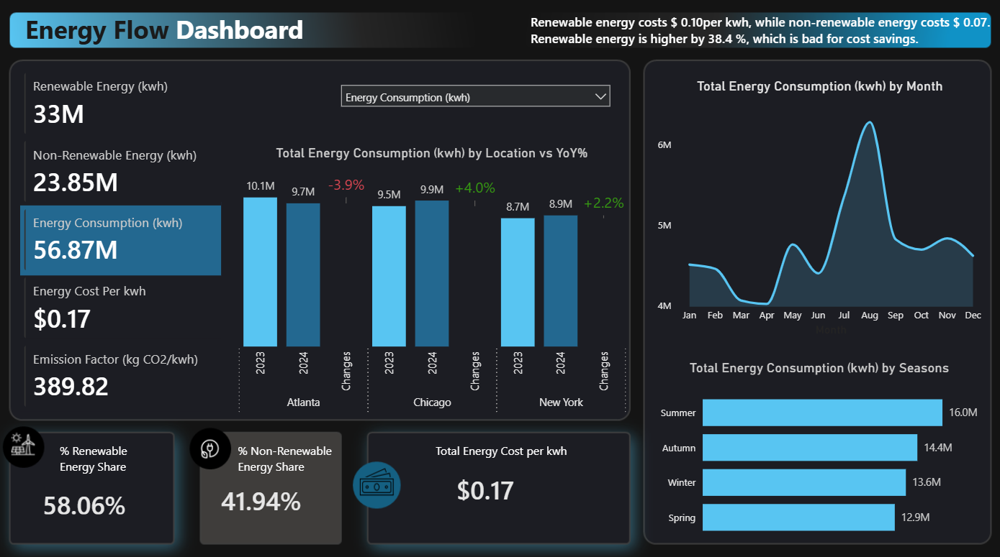
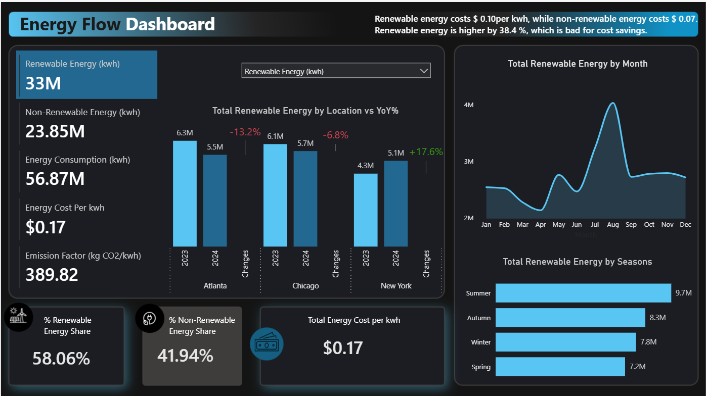
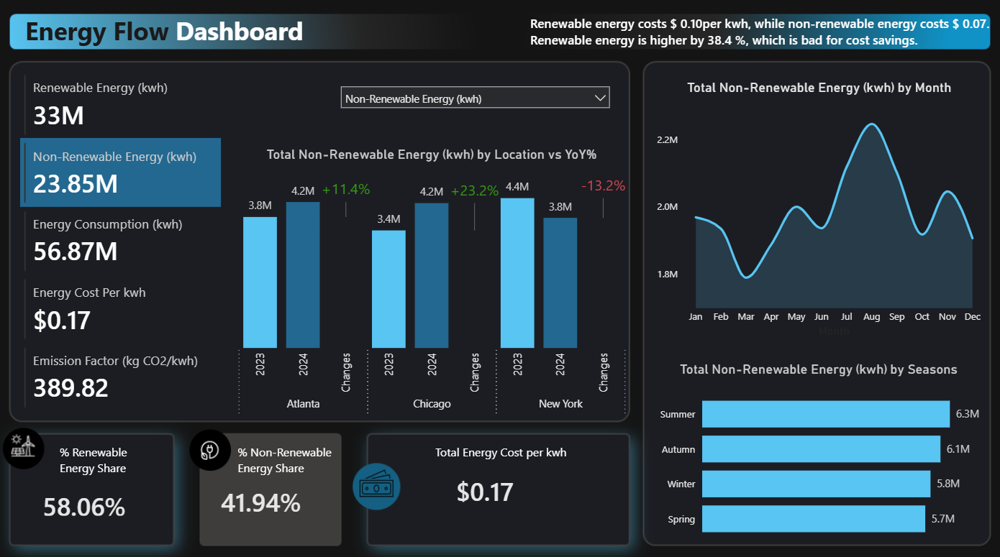
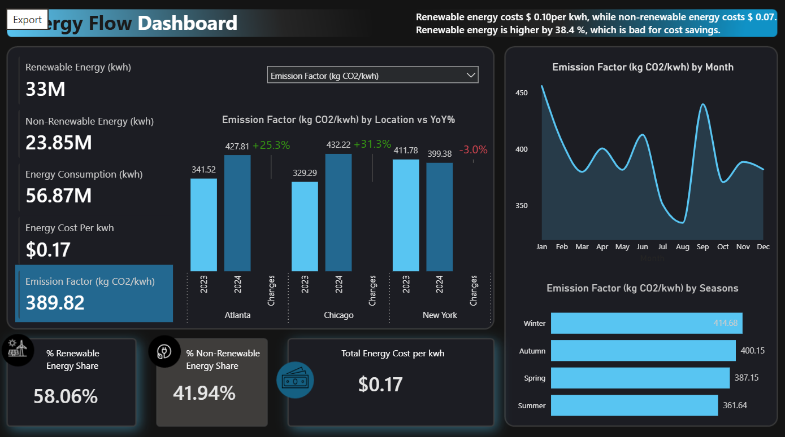
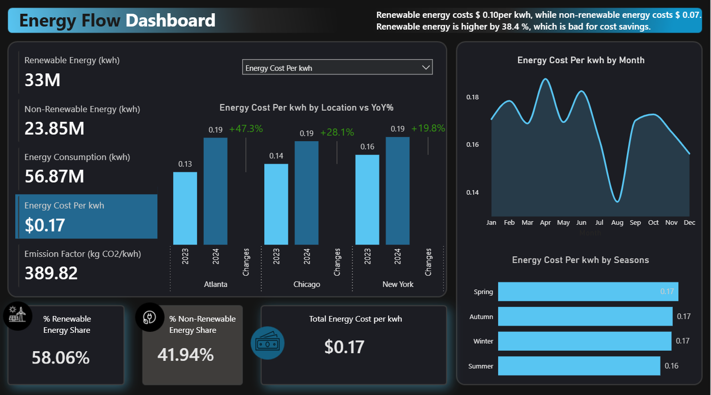

## Title

### Energy Consumption & Cost Analysis Dashboard (Power BI)

## Overview

#### This project analyzes renewable and non-renewable energy consumption, costs, and emissions across multiple regions.

##### At a high level, total energy consumption is around 56.9 million kWh, with renewable energy making up about 58% of the total. However, one key insight is that renewable energy is significantly more expensive per kWh compared to non-renewable energy, highlighting a clear trade-off between sustainability and cost efficiency.

##### Looking at trends over time, energy consumption peaks during the summer months, likely driven by increased cooling demand. This seasonal pattern is consistent across both renewable and non-renewable sources.

##### When comparing year-over-year performance, we see that overall energy demand is growing slightly, but not uniformly across regions. For example, Chicago and New York show moderate increases in energy consumption, while Atlanta shows a slight decline.

##### In terms of renewable energy, New York stands out with a strong increase in adoption, while Atlanta and Chicago both show declines. At the same time, non-renewable energy usage is increasing in Chicago and Atlanta, indicating continued reliance on traditional energy sources in those regions.

##### From a regional perspective, this creates a clear contrast. New York appears to be transitioning more effectively toward renewable energy, supported by a reduction in emissions. In contrast, Chicago and Atlanta are experiencing rising emissions, driven by increased non-renewable energy usage.

##### When we look at costs, there is a noticeable upward trend across all regions, with Atlanta experiencing the most significant increase. This highlights growing pressure on energy pricing and the importance of cost optimization strategies.

## Key Insights

- Renewable energy accounts for 58% but is more expensive
- Energy demand peaks in summer
- New York leads in renewable adoption
- Costs are rising across all regions

## Tools Used

- Power BI
- Data Visualization
- Data Analysis
